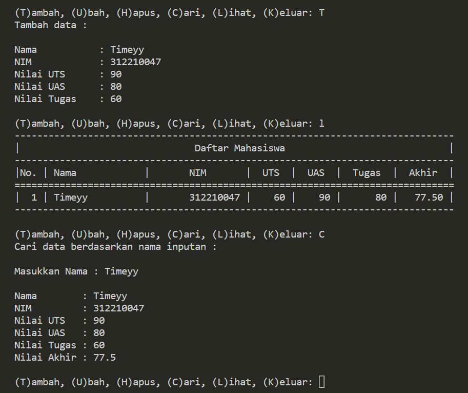

# Pertemuan-10

## Profil
| Variable | Isi |
| -------- | --- |
| **Nama** | Gilar Sumilar |
| **NIM** | 312210407 |
| **Kelas** | TI.22.A.4 |
| **Mata Kuliah** | Bahasa Pemrograman |

### Tugas Praktikum
Buat program sederhana yang akan menampilkan daftar nilai
mahasiswa, dengan ketentuan :

- Program dibuat dengan menggunakan Dictionary
- Tampilkan menu pilihan: (Tambah Data, Ubah Data, Hapus Data, Tampilkan Data, Cari Data)
- Nilai Akhir diambil dari perhitungan 3 komponen nilai (tugas: 30%, uts: 35%, uas: 35%)
- Buat flowchart dan penjelasan programnya pada README.md. • Commit dan push repository ke github.

## Penjelasan Program 

### Menambahkan data input
```Python
list = {}

while True:
    c = input("\n(T)ambah, (U)bah, (H)apus, (C)ari, (L)ihat, (K)eluar: ")

    # Menambahkan data inputan 
    if c.lower() == 't':
        print("Tambah data :\n")
        nama    = input("Nama           : ")
        nim     = int(input("NIM            : "))
        uts     = int(input("Nilai UTS      : "))
        uas     = int(input("Nilai UAS      : "))
        tugas   = int(input("Nilai Tugas    : "))
        akhir = (tugas * 30/100) + (uts * 35/100) + (uas * 35/100)
        list[nama] = [nim, tugas, uts, uas, akhir]
```
`if c.lower` Berfungsi seperti `or` input bisa berjalan jika memasukan T/t 

### Mengubah data inputan
``` Python
    # Mengubah data inputan
    elif c.lower() == 'u':
        print("Ubah Data :")
        nama = input("\nMasukkan Nama  : ")
        if nama in list.keys():
            nim     = int(input("NIM            : "))
            uts     = int(input("Nilai UTS      : "))
            uas     = int(input("Nilai UAS      : "))
            tugas   = int(input("Nilai Tugas    : "))
            akhir = (tugas * 30/100) + (uts * 35/100) + (uas * 35/100)
            list[nama] = [nim, tugas, uts, uas, akhir]
        else:
            print("NAMA {0} TIDAK ADA!".format(nama))
```
`print("NAMA {0} TIDAK ADA!".format(nama))` memanggil variable nama 

### Menghapus Data yg sudah di input
``` Python
    # Menghapus inputan Nama
    elif c.lower() == 'h':
        print("Hapus berdasarkan nama inputan :")
        nama = input("\nMasukkan Nama  : ")
        if nama in list.keys():
            del list[nama]
            print("\nData {0} berhasil di hapus".format(nama))
        else:
            print("NAMA {0} TIDAK ADA!".format(nama))
```
### Mencari data yg sudah di input
``` Python
    # Mencari data yg sudah di input
    elif c.lower() == 'c':
        print("Cari data berdasarkan nama inputan :")
        nama = input("\nMasukkan Nama : ")
        if nama in list.keys():
            print("\nNama        : {0}".format(nama))
            print("NIM         : {0}".format(nim))
            print("Nilai UTS   : {0}".format(uts))
            print("Nilai UAS   : {0}".format(uas))
            print("Nilai Tugas : {0}".format(tugas))                  
            print("Nilai Akhir : {0}".format(akhir)) 
        else:
            print("NAMA {0} TIDAK ADA!".format(nama))
```
### Menanpilkan seluruh data 
``` Python
    # Menampilkan seluruh data 
    elif c.lower() == 'l':
        if list.items():
            print("-"*78)
            print("|                               Daftar Mahasiswa                             |")
            print("-"*78)
            print("|No. | Nama            |       NIM       |  UTS  |  UAS  |  Tugas  |  Akhir  |")
            print("="*78)
            i = 0
            for z in list.items():
                i += 1
                print("| {no:2d} | {0:15s} | {1:15d} | {2:5d} | {3:5d} | {4:7d} | {5:7.2f} |"
                      .format(z[0][:13], z[1][0], z[1][1], z[1][2], z[1][3], z[1][4], no=i))
            print("-"*78)
        else:
            print("-"*78)
            print("|                               Daftar Mahasiswa                             |")
            print("-"*78)
            print("|No. | Nama            |       NIM       |  UTS  |  UAS  |  Tugas  |  Akhir  |")
            print("-"*78)
            print("|                       TIDAK ADA DATA! Silakan tambah data                  |")
            print("-"*78)
```

``` Python 
for z in list.items():
                i += 1
                print("| {no:2d} | {0:15s} | {1:15d} | {2:5d} | {3:5d} | {4:7d} | {5:7.2f} |"
                      .format(z[0][:13], z[1][0], z[1][1], z[1][2], z[1][3], z[1][4], no=i))
```
`list.items():` memanggil isi dari variable list, `.format`  Digunakan untuk mengatur format string yang nantinya akan dicetak atau ditampilkan ke layar.


### Keluar program
```Python
    # Keluar program
    elif c. lower() == 'k':
        break

    else:
        print("\n INPUT {} TIDAK ADA!, Silakan pilih [T/U/H/C/L] untuk menjalankan program!".format(c))
```

### Hasil program


### Hasil hanya sebagian dari fungsi program


